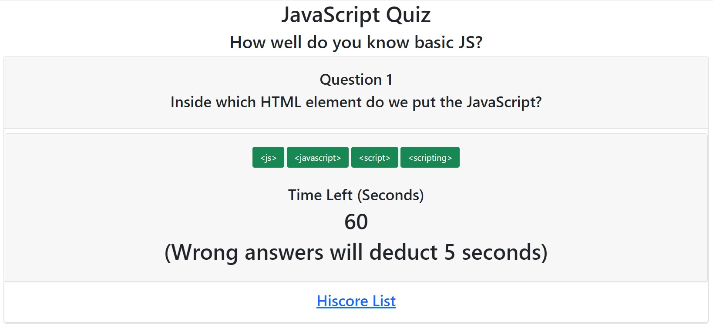

# codingquiz

**Name**: Javascript Quiz

Description and usage: This application is an interactive javascript quiz on basic javascript items. The quiz has a start screen, 8 dynamically updating question screens, and finally a score screen. The user will be timed during this quiz and if they get an answer wrong they will have 5 seconds deducted from their remaining time. At the end of the quiz the user will see their final score and have the option to submit their initials and score to the hiscores list. The hiscores list shows a history of local hiscores in chronilogical order starting from the top.

**Visuals**:  This image shows the example of a question screen being shown to a user with the question number, question prompt, four answer buttons, time remaining, and finally link to hiscores page.

**Technologies used**: HTML, Javascript

**Link to deployed application**: https://rikioh.github.io/codingquiz/

**Expected behavior/acceptance criteria of javascript code**:

GIVEN I am taking a code quiz 
WHEN I click the start button 
THEN a timer starts and I am presented with a question 
WHEN I answer a question 
THEN I am presented with another question 
WHEN I answer a question incorrectly 
THEN time is subtracted from the clock 
WHEN all questions are answered or the timer reaches 0 
THEN the game is over 
WHEN the game is over 
THEN I can save my initials and my score
